# Part 2 art — gallery

Quick visual pass. Full review page: `review.html`. Rationale: `../06-art.md`.

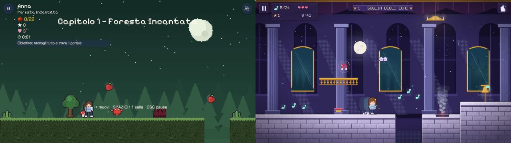
*Before / after: Part 1 Level 1 (left) vs Part 2 Level 1 target (right).*

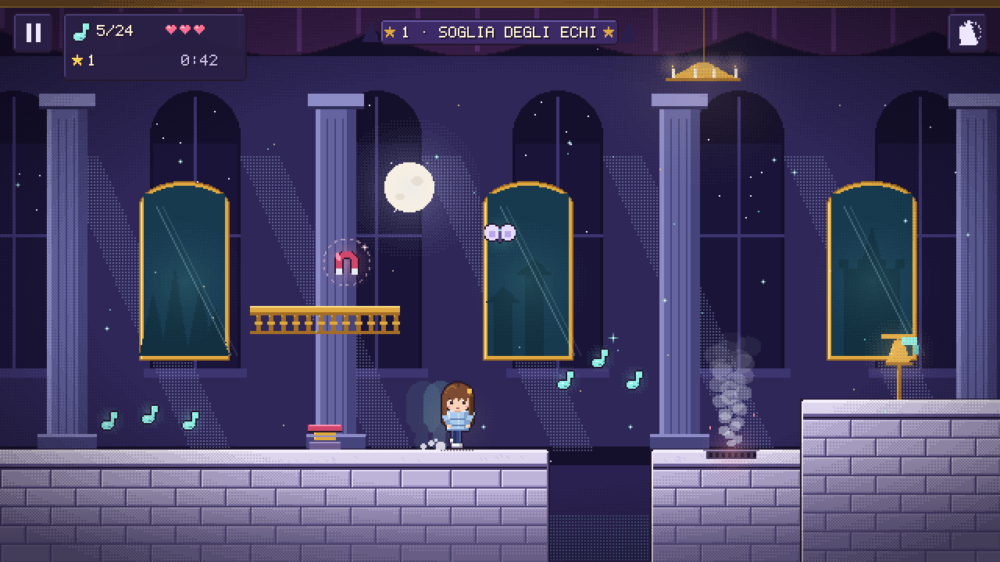
*Level 1, Soglia degli Echi: marble autotiles, layered moonlit hall, 32×48 Anna, steam vent, magnet, HUD panel.*

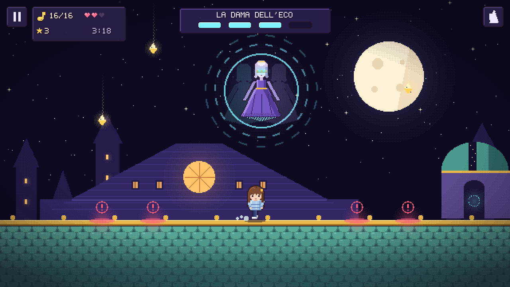
*Level 6 arena: La Dama dell'Eco, 7-slot debris telegraph with a 3-slot safe lane, boss bar.*

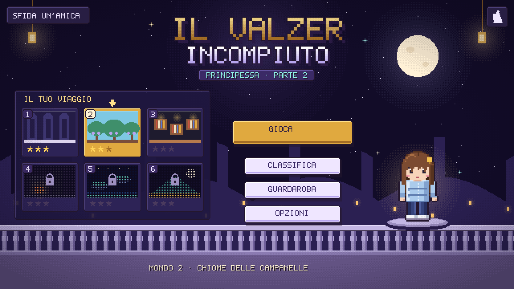
*Menu and world select: world cards, 9-slice buttons, Guardaroba (title is a placeholder).*

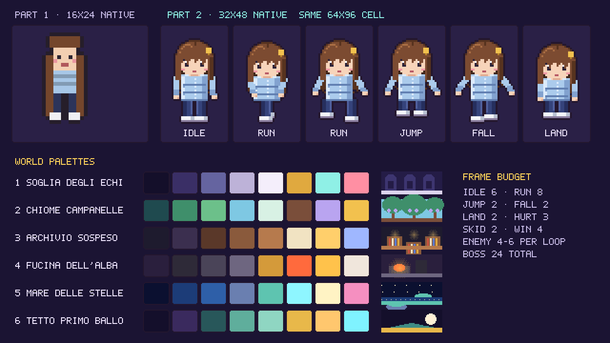
*Part 1 16×24 vs Part 2 32×48 heroine, six poses, six world palettes, frame budget.*

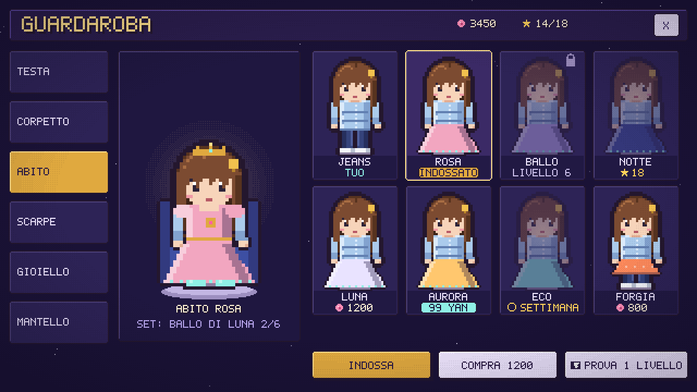
*Wardrobe / shop (IT): slots, look states and prices; worn look selected, so only "INDOSSATO".*

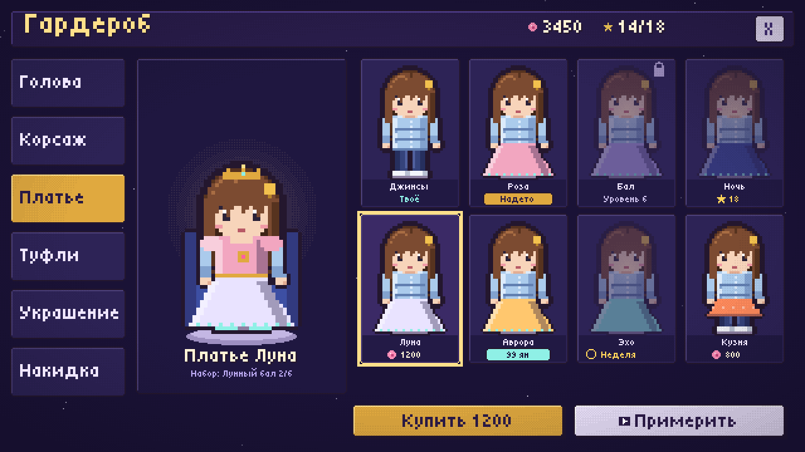
*Wardrobe / shop (RU): purchasable look selected, «Купить 1200» + opt-in «Примерить», real Tiny5 Cyrillic font.*

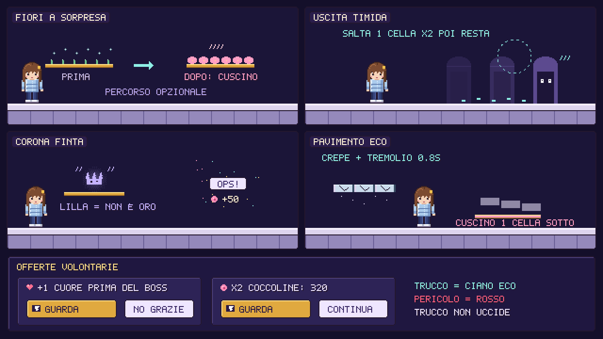
*Trick telegraphs in echo cyan (never lethal) and the opt-in rewarded offer cards.*

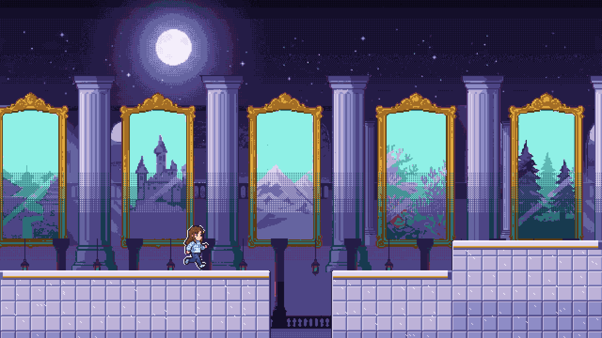
*AI-sourced Level 1: generated World 1 layers + processed Anna over Part 1 tiles.*

## Part 1 today (real screenshots)

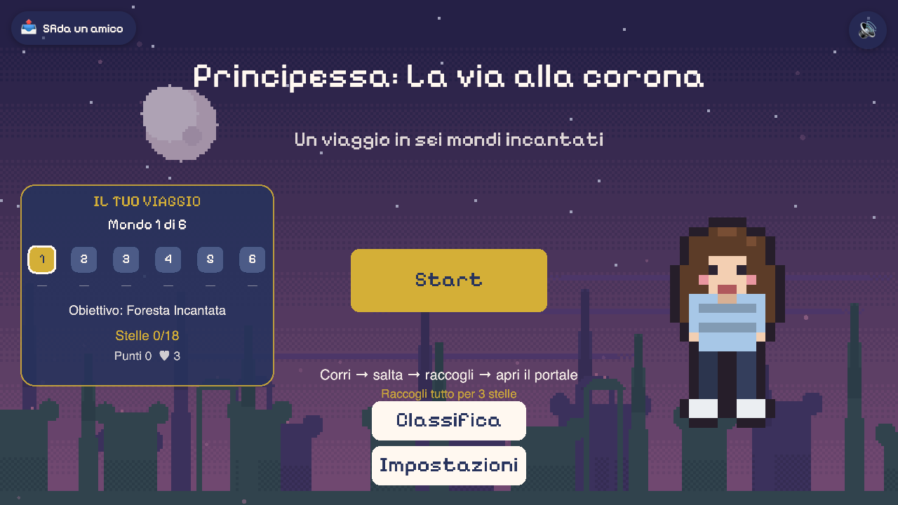
*Menu: floating controls, heroine scaled ×1.9 into large blocks.*

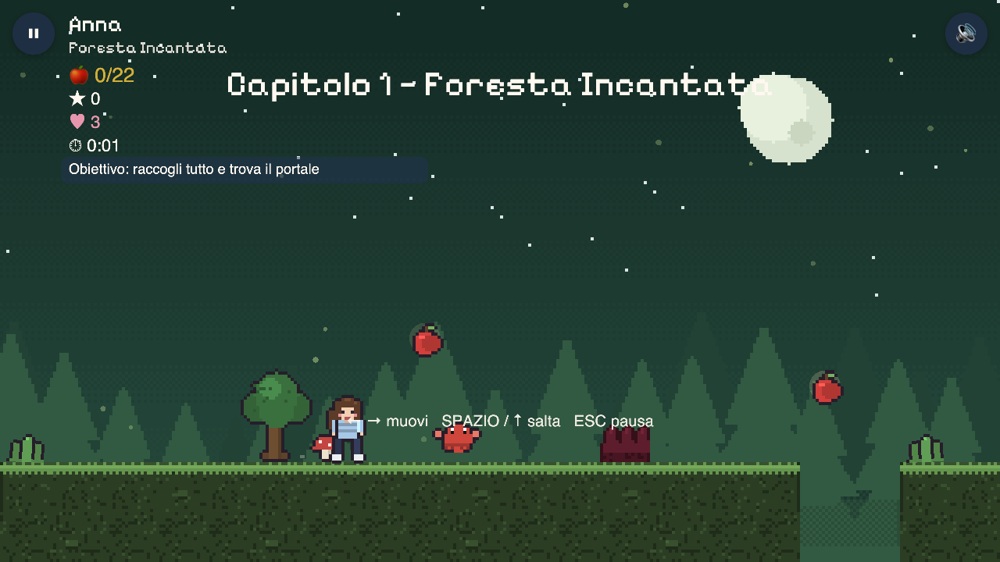
*Level 1, Foresta Incantata: empty sky, repeated speckle ground, text over sprites.*

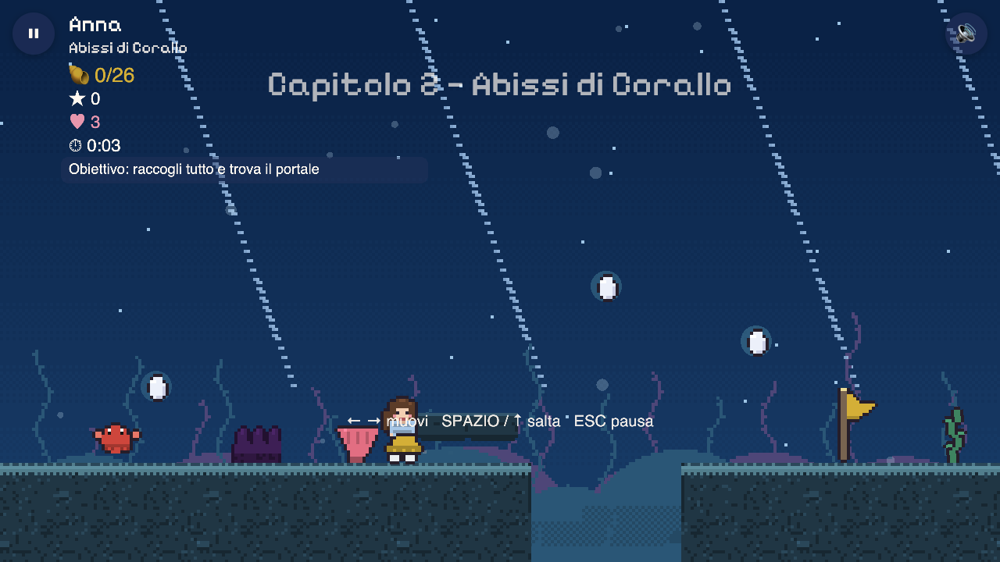
*Level 2, Abissi di Corallo: flat silhouettes, dark hazard lumps.*

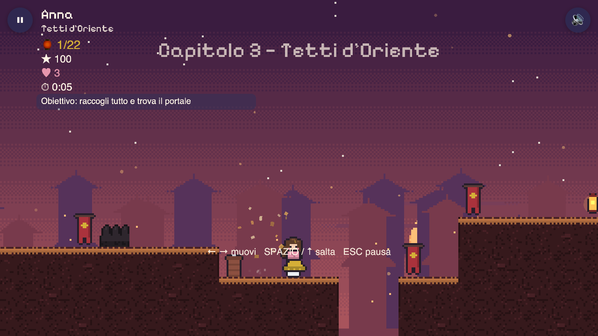
*Level 3, Tetti d'Oriente: maroon ground on a maroon sky.*

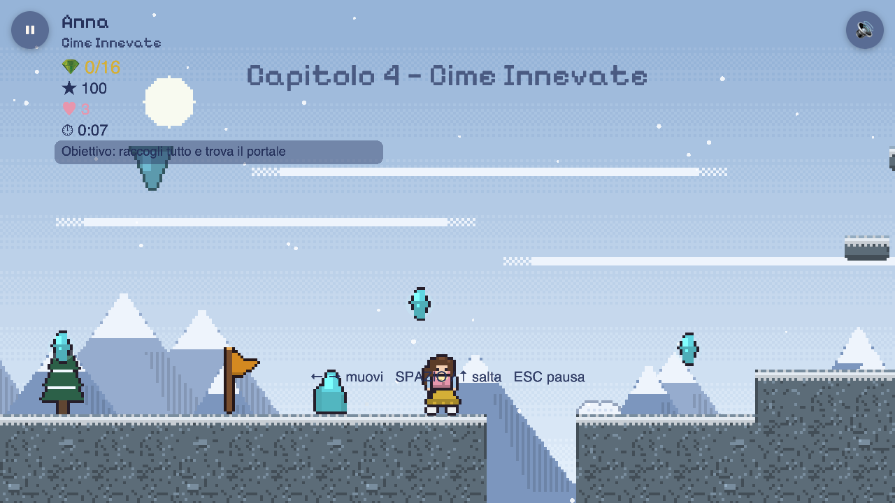
*Level 4, Cime Innevate: pale scene, low lane contrast.*

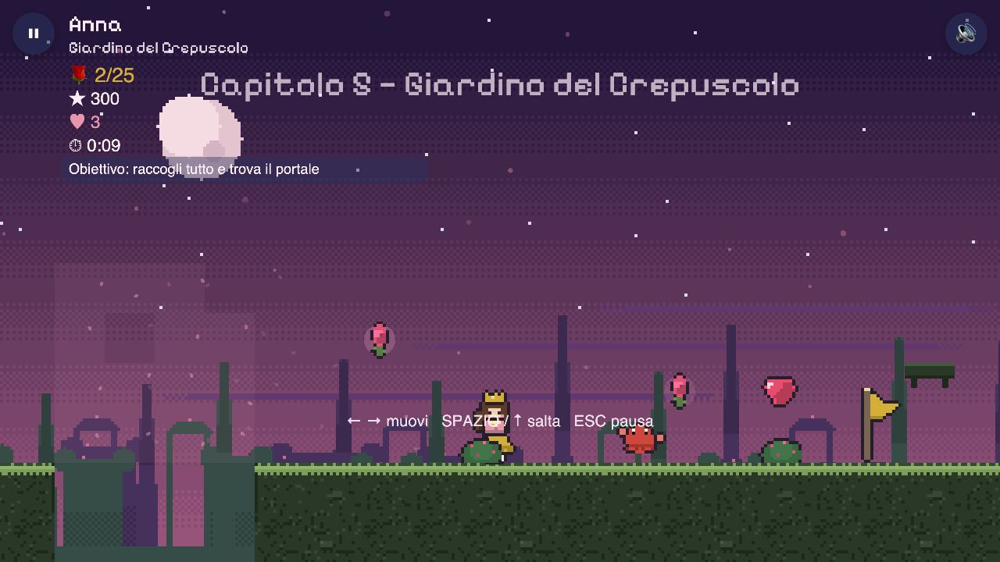
*Level 5, Giardino del Crepuscolo: flat single-tone parallax.*

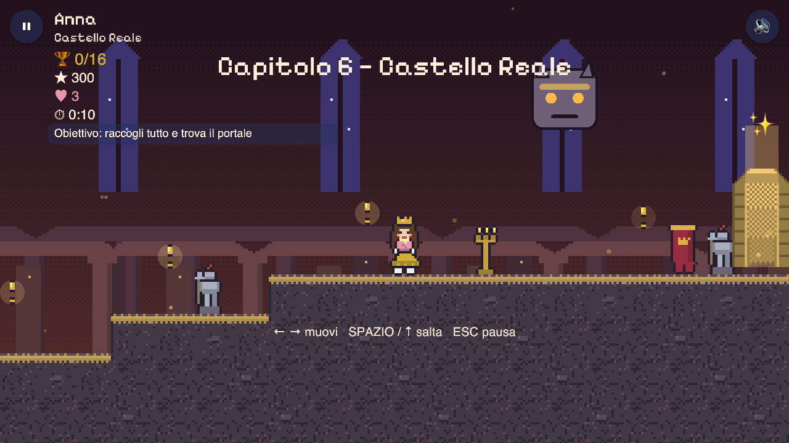
*Level 6 boss: primitive rectangle guardian, title over the boss.*

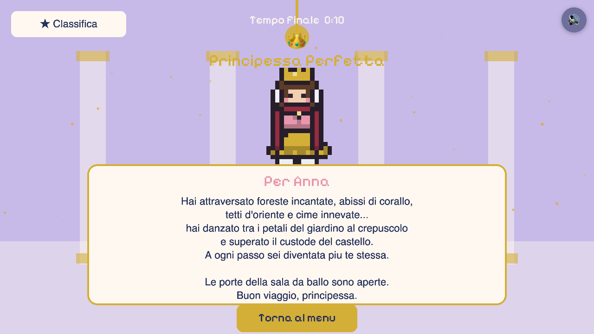
*Finale: flat lilac, rectangle pillars, letter card covering the scene.*

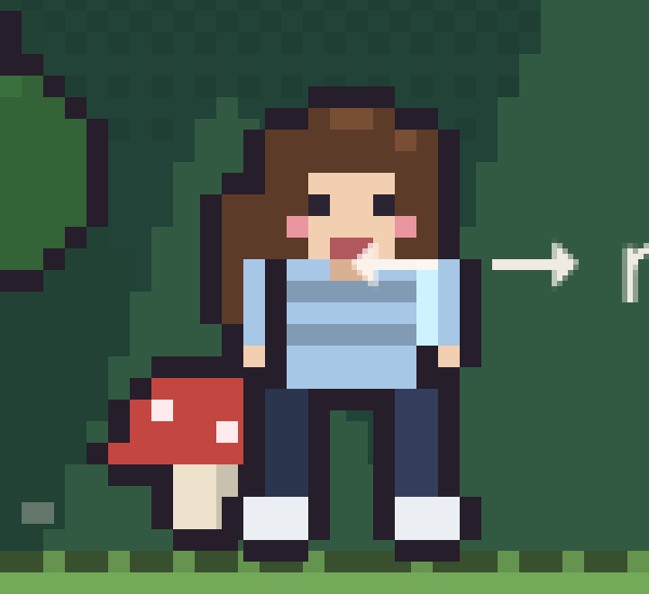
*Anna at 16×24, 6× zoom.*
